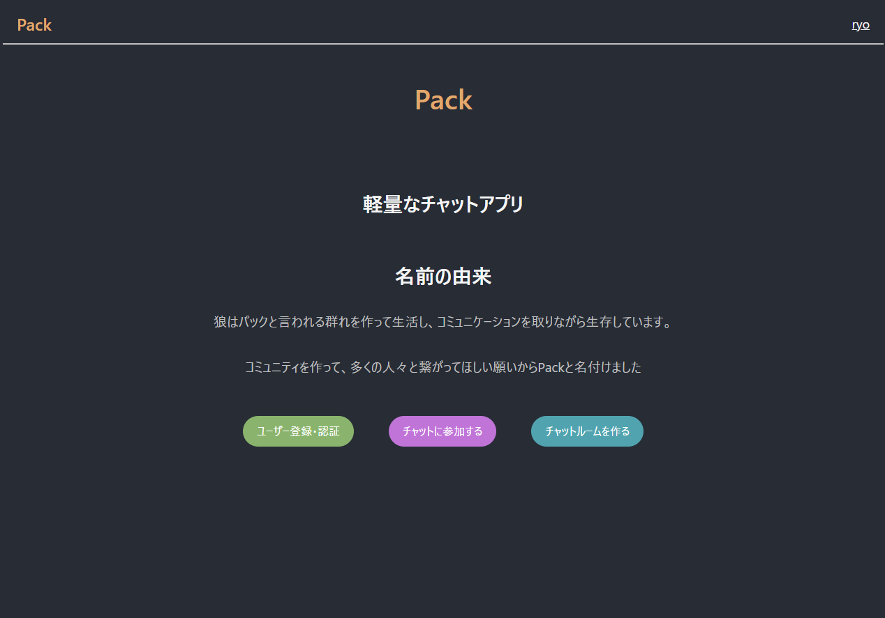
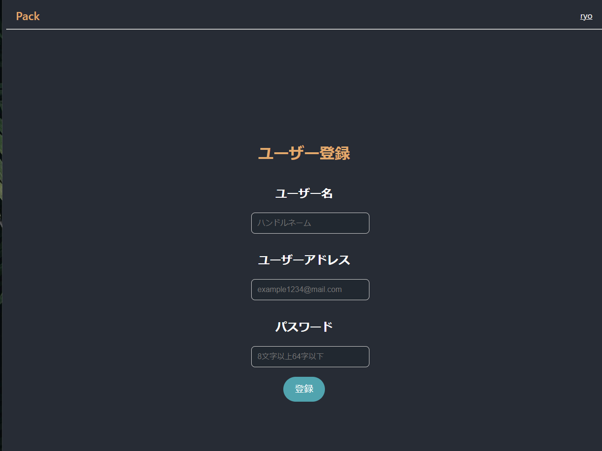
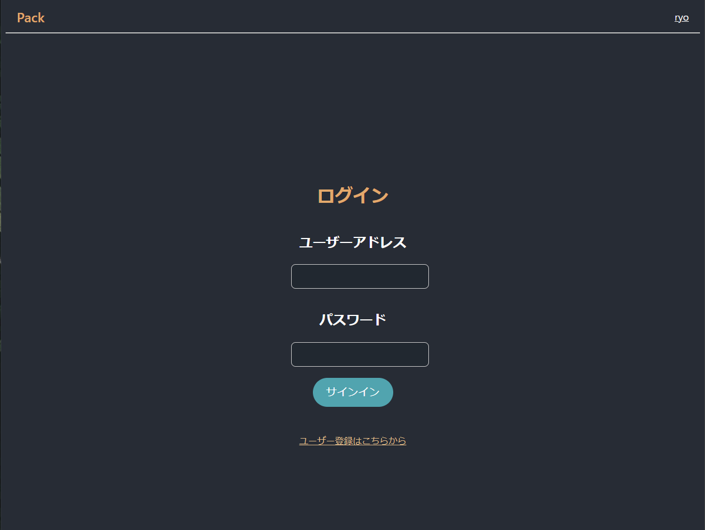
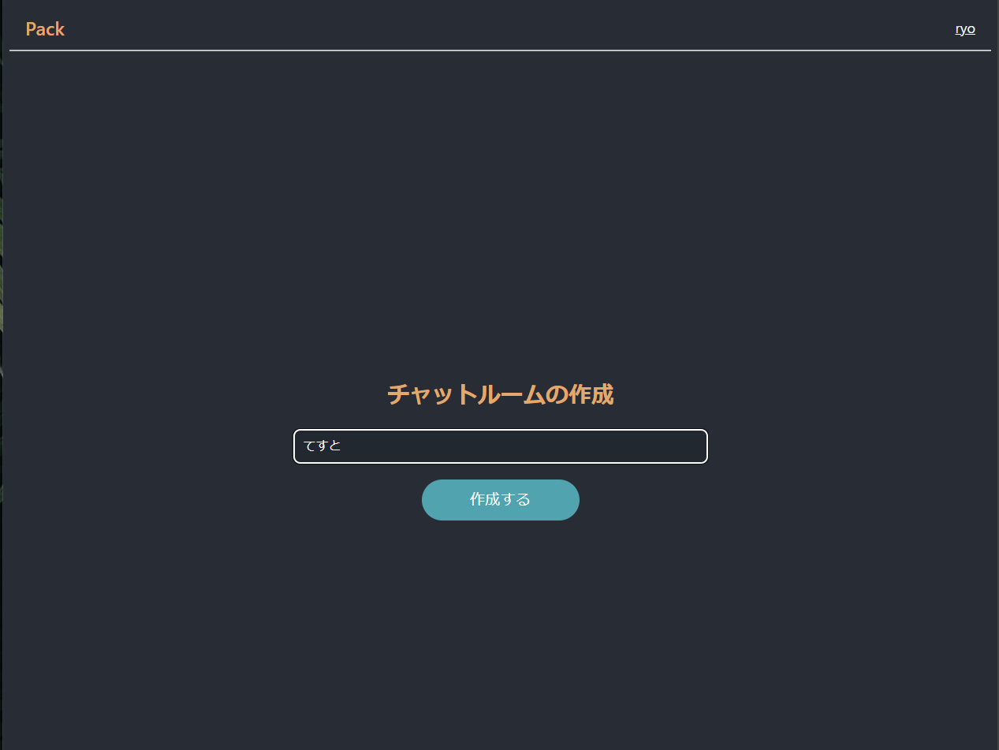
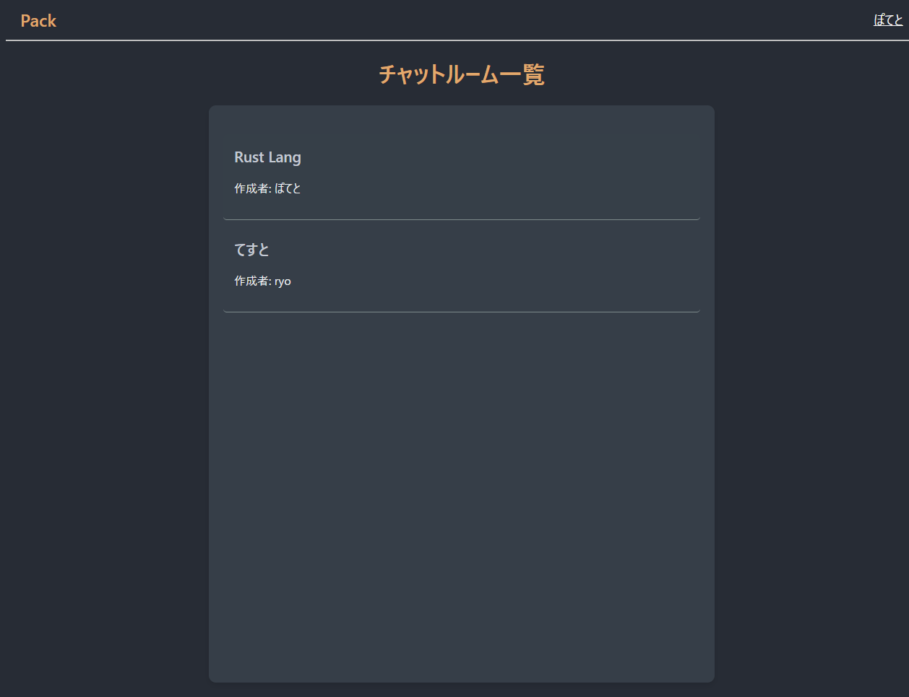
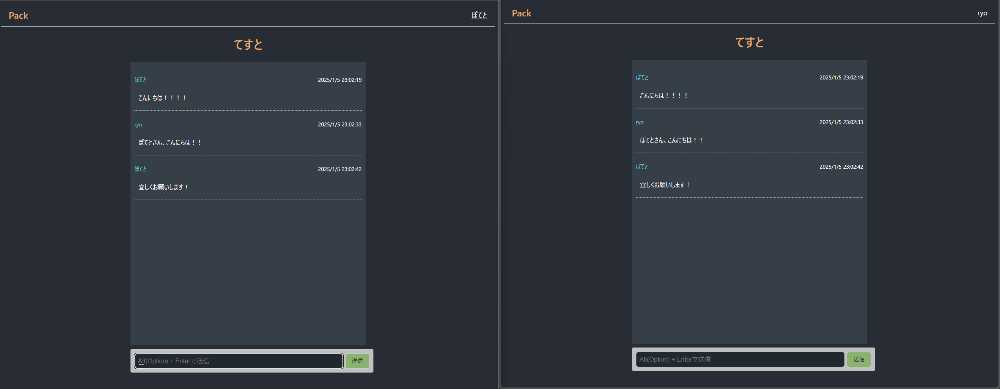

# chat-app-server






## Overview
WebSocket通信を使用したリアルタイムチャットアプリケーション  
NextJsを使用し、サーバーサイドは[chat-app-server](https://github.com/nakaryo716/chat-app-server)を使用しています。  
## Getting Started
### Prerequisites
以下のソフトウェアが必要です:
- [Docker](https://www.docker.com/)
### Installation And Run
1. リポジトリをクローンします:
    ```bash
    git clone https://github.com/nakaryo716/chat-app
    cd chat-app
    ```
2. 依存関係のインストールを行います
    ```bash
    npm i
    ```
3. ```src/api/api.ts```のサーバーサイドのURLを自身のコンピュータのIPアドレスに設定してください
    ```typescript
    export const HostApi = "https://192.168.1.0:1443";
    export const HostWsApi = "wss://192.168.1.0:1443";
    ```

4. Dockerコンテナを立ち上げます:  
    ```bash
    docker compose up
    ```
5. next-appコンテナが起動し、使用可能になります

## Communicate with WebSocket Server
認証やWebSocket通信などのサーバーサイドの実装は以下のリポジトリから取得し、実行することができます。  
[chat-app-server](https://github.com/nakaryo716/chat-app-server)  
Nginxを使用したリバースプロキシで通信を行います  
実行方法については
[chat-app-proxy-example](https://github.com/nakaryo716/chat-app-proxy-example)の```アプリケーションの全体の実行```を御覧下さい

## License
このプロジェクトは MIT ライセンスに基づいてライセンスされています。詳細については、LICENSE ファイルを参照してください。
